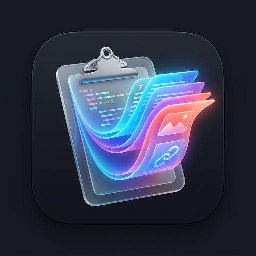

<div align="center">

  

  # PasteFlow (流贴)

  **重新想象 macOS 剪贴板的流转体验**  
  更快、更轻、更纯粹。为极致键盘党、开发者与设计师量身打造的原生剪贴板管理器。

  [](https://apple.com)
  [](https://swift.org)
  [](https://github.com/thesadboy/PasteFlow/releases)
  [](LICENSE)
  [](https://thesadboy.github.io/PasteFlow/)

  [官方网站 & 在线模拟体验](https://thesadboy.github.io/PasteFlow/) · [下载最新 DMG](https://github.com/thesadboy/PasteFlow/releases) · [问题反馈](https://github.com/thesadboy/PasteFlow/issues)

</div>

---

## ✨ 核心特性

- **🪟 原生 Finder 文件全流转**：
  - 完美适配 macOS 文件流转规范，深度集成 `NSFilenamesPboardType` 与 `public.file-url`；
  - 自动识别真实文件路径，优先于图片检测；
  - 动态提取系统原生的文件类型图标（PDF、DMG、ZIP、代码文件等）与文件后缀角标；
  - 可直接将文件卡片粘贴至 Finder、微信、桌面或终端。

- **🧊 沉浸式横向卡片流与零焦点争夺**：
  - 底层基于 `.nonactivatingPanel` 风格悬浮设计；
  - 唤出时不夺走当前前台编辑软件的光标与工作焦点，选定后毫秒级还原。

- **⚡ 全键盘盲打与瞬发**：
  - 双手不离键盘，极速流畅输出；
  - `⌘ 1` ~ `⌘ 9` 直达前 9 项历史；`↩ Return` 原样粘贴；`⇧ ↩` 滤除杂乱样式的纯文本粘贴。

- **🧠 多维类型语义感知**：
  - 自动识别代码片段并进行语法高亮；
  - 智能感知十六进制 Hex 颜色代码（如 `#8B5CF6`）并实时渲染色块预览；
  - 网页链接、高分辨率图片自适应排版。

- **🛡️ 100% 隐私至上**：
  - 绝无外部网络上传，不含任何追踪统计 SDK；
  - 历史数据纯本地加密存储于 `~/Library/Application Support/PasteFlow/`；
  - 支持多档历史保留期限与一键安全清空。

- **🔄 Sparkle 自动更新机制**：
  - 内置行业标准的 Sparkle 2.x 升级引擎；
  - 自动轮询版本源，支持一键差量升级与平滑重启。

---

## ⌨️ 快捷键速查

| 操作 | 快捷键 | 说明 |
| :--- | :--- | :--- |
| **唤出 / 隐藏** | <kbd>⌘</kbd> <kbd>⇧</kbd> <kbd>V</kbd> | 全局呼出面板（支持在偏好设置中自由录制按键） |
| **直接粘贴** | <kbd>↩ Return</kbd> 或 双击卡片 | 自动激活目标 App 并模拟粘贴 |
| **纯文本粘贴** | <kbd>⇧</kbd> <kbd>↩ Return</kbd> | 自动过滤富文本与排版格式 |
| **瞬发前 9 项** | <kbd>⌘</kbd> <kbd>1</kbd> ~ <kbd>⌘</kbd> <kbd>9</kbd> | 按数字序号瞬时定位并粘贴 |
| **左右浏览** | <kbd>←</kbd> / <kbd>→</kbd> | 在横向卡片流中切换选定项 |
| **删除卡片** | <kbd>⌫ Delete</kbd> | 删除当前卡片（智能隔离搜索输入框输入） |
| **复制到剪贴板** | <kbd>⌘</kbd> <kbd>C</kbd> | 将选中卡片重新存入系统剪贴板（不自动粘贴） |
| **偏好设置** | <kbd>⌘</kbd> <kbd>,</kbd> | 打开设置面板（配置历史期限、快捷键、音效） |
| **关闭浮层** | <kbd>Esc</kbd> | 快速隐藏弹层 |

---

## 🚀 安装与使用

### 方式 1：直接下载安装包（推荐）
前往 [GitHub Releases](https://github.com/thesadboy/PasteFlow/releases) 页面，下载最新的 `PasteFlow.dmg`，双击打开并将 `PasteFlow.app` 拖入 `Applications`（应用程序）目录即可。

### 方式 2：通过源码极速构建安装
```bash
# 1. 克隆代码仓库
git clone https://github.com/thesadboy/PasteFlow.git
cd PasteFlow

# 2. 编译并直接安装至 /Applications 启动体验
./scripts/run.sh
```

> **系统要求**：macOS 13.0 (Ventura) 及更高版本（原生支持 Apple Silicon M 系列芯片与 Intel 处理器）。

---

## 🔄 升级与更新

PasteFlow 基于 **Sparkle 2.x** 提供了完整的无缝升级支持：

1. **自动检查**：应用在后台按设定周期自动检索新版本；
2. **手动检查**：
   - 点击状态栏 PasteFlow 图标 -> 选择 **「检查更新...」**
   - 或进入 **「偏好设置 -> 关于」** 点击 **「检查更新」**
3. **升级源地址**：
   - 官方更新 Feed：`https://thesadboy.github.io/PasteFlow/appcast.xml`

---

## 🔒 权限说明

- **辅助功能权限（Accessibility）**：
  PasteFlow 仅在您执行粘贴操作（按 <kbd>↩</kbd> 或双击卡片）时，通过系统的 `CGEvent` 发送 `Cmd+V` 键位事件以将选定内容注入目标应用。系统要求模拟按键必须获取辅助功能授权，应用**绝不会**利用此权限记录或窃取键盘输入。

---

## 🛠️ 项目架构

```
PasteFlow/
├── Sources/PasteFlow/
│   ├── App/          # 应用生命周期 AppDelegate 与 AppState 状态单例
│   ├── Core/         # 剪贴板监听、粘贴执行、热键捕获、本地持久化与 Sparkle 升级管理器
│   ├── Models/       # ClipItem、ContentType 与 Pinboard 数据模型
│   └── UI/           # SwiftUI & AppKit 混合视图（卡片、毛玻璃弹层、偏好设置、状态栏菜单）
├── docs/             # 官方网站 Landing Page（托管于 GitHub Pages）
├── scripts/          # 本地编译 build.sh、安装启动 run.sh 与打包发布 dist.sh
├── appcast.xml       # Sparkle 自动更新 RSS 描述文件
└── Package.swift     # Swift Package 依赖与构建配置
```

---

## 📄 开源许可

本项目遵循 [MIT License](LICENSE) 开源协议。
